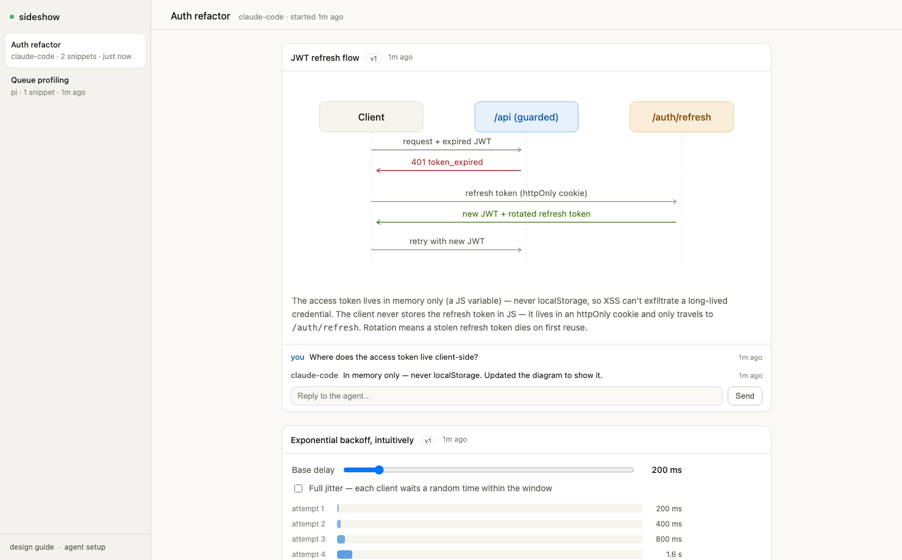

# sideshow

[](https://github.com/benvinegar/sideshow/actions/workflows/ci.yml)
[](LICENSE)

**A live visual surface for terminal coding agents.**

Coding agents are stuck in plain text. sideshow gives any agent — Claude Code,
pi, opencode, amp, anything that can run a shell command — a browser canvas to
draw on: diagrams while it explains, UI sketches while it plans, charts while
it profiles. Snippets appear live in your browser, grouped by agent session,
and you can comment on any of them — feedback flows straight back to the agent
in its terminal.

<picture>
  <source media="(prefers-color-scheme: dark)" srcset="docs/sideshow-dark.png">
  
</picture>

*An agent published a sequence diagram while explaining an auth refactor; the
user asked a question under it in the browser; the agent answered in the
thread and revised the snippet — all without leaving the terminal.*

## Quick start

```sh
npm install
npx sideshow serve --open     # surface on http://localhost:4242
```

Leave the tab open. Then teach your agent about it (works for any agent that
reads AGENTS.md / CLAUDE.md):

```sh
curl -s http://localhost:4242/setup >> AGENTS.md
```

That's the whole integration for pi, opencode, amp, codex, or anything with a
bash tool — the block tells the agent how to publish snippets and poll for
your comments with plain `curl`. Requires Node ≥ 22.18.

## How agents connect

Three tiers, pick what the agent supports:

1. **Shell (universal)** — the `sideshow` CLI or raw `curl`. Works with every
   coding agent in existence:
   ```sh
   sideshow publish sketch.html --title "Cache layout"   # session handled automatically
   sideshow wait                                         # block until the user comments
   ```
2. **MCP (richer)** — tools: `publish_snippet`, `update_snippet`,
   `wait_for_feedback`, `reply_to_user`, `list_snippets`, `get_design_guide`.
   Two transports, same tools:
   ```sh
   # stdio (local)
   claude mcp add --scope user sideshow -- npx -y sideshow mcp
   # streamable HTTP — the server itself speaks MCP at /mcp (local or deployed)
   claude mcp add --scope user --transport http sideshow http://localhost:4242/mcp
   ```
3. **HTTP** — `POST /api/snippets`, `PUT /api/snippets/:id`,
   `GET /api/comments?wait=60` (long-poll). See `/guide`.

## How agents learn it

Three surfaces, by agent capability — you rarely need more than one:

- **MCP instructions (automatic)**: any MCP-connected agent receives usage
  instructions and tool descriptions the moment it connects. Zero setup.
- **AGENTS.md block**: `curl -s http://localhost:4242/setup >> AGENTS.md`
  teaches bash-only agents the curl workflow.
- **Claude Code skill (optional)**: `cp -r skills/sideshow ~/.claude/skills/`
  installs a skill that triggers when you ask the agent to illustrate or
  visualize something, with workflow guidance beyond the basics.

## The model

- **Session** — one agent conversation. Sessions appear in the sidebar;
  rename them by clicking the title, delete them when done.
- **Snippet** — one published HTML fragment, rendered in a sandboxed iframe
  (`sandbox="allow-scripts"`, no same-origin) with a CSP-enforced CDN
  allowlist. Revisions are versioned; flip between versions in the viewer.
- **Comment** — a thread under each snippet. You type in the browser; agents
  receive via long-poll (`sideshow wait` / `wait_for_feedback`) and can reply.
  A snippet's `sendPrompt('...')` buttons post to the same thread.

Agents get a design contract at `/guide` (theme CSS variables, light/dark,
fragment rules) so snippets look native instead of chaotic.

## Architecture

- `server/app.ts` — runtime-agnostic Hono app: REST API, SSE live feed,
  long-poll comments, snippet renderer.
- `server/storage.ts` — `Store` interface + JSON-file implementation
  (sessions, versioned snippets, comments).
- `viewer/` — single-file viewer: session sidebar, live snippet stream,
  comment threads.
- `bin/sideshow.js` — zero-dependency CLI.
- `mcp/server.ts` — stdio MCP server; a thin client over the HTTP API.

## Deploy to the cloud (Cloudflare)

The same app deploys to Cloudflare Workers, so agents anywhere — SSH boxes,
CI, your laptop — draw to a surface you can open from any browser:

```sh
npx wrangler login
npx wrangler secret put SIDESHOW_TOKEN     # pick a long random token
npm run deploy                             # → https://sideshow.<you>.workers.dev
```

Everything requires the token once deployed: open the viewer as
`https://sideshow.<you>.workers.dev/?key=<token>` (sets a cookie), and give
agents the environment:

```sh
export SIDESHOW_URL=https://sideshow.<you>.workers.dev
export SIDESHOW_TOKEN=<token>
```

The CLI, stdio MCP, and curl (`-H "Authorization: Bearer $SIDESHOW_TOKEN"`)
all work unchanged against the deployed URL — local and cloud are the same
product. Remote agents can also skip the CLI entirely and connect MCP
directly to the edge:

```sh
claude mcp add --transport http sideshow https://sideshow.<you>.workers.dev/mcp \
  --header "Authorization: Bearer $SIDESHOW_TOKEN"
```

How it works: the entire app runs inside one Durable Object (`workers/`),
with SQLite-in-DO storage. One DO instance per board means the in-memory
event bus is authoritative — SSE and long-poll behave exactly like the local
server. `/guide` and `/setup` are served with the deployed origin substituted
into every example.

## Development

```sh
npm run dev          # server with watch
npm test             # node --test
npm run typecheck    # tsc --noEmit
npm run lint         # oxlint
npm run format       # oxfmt
```

No build step: TypeScript runs directly on Node ≥ 22.18 via native
type-stripping. See [AGENTS.md](AGENTS.md) for architecture rules and
contribution guidance.

## License

[MIT](LICENSE)
